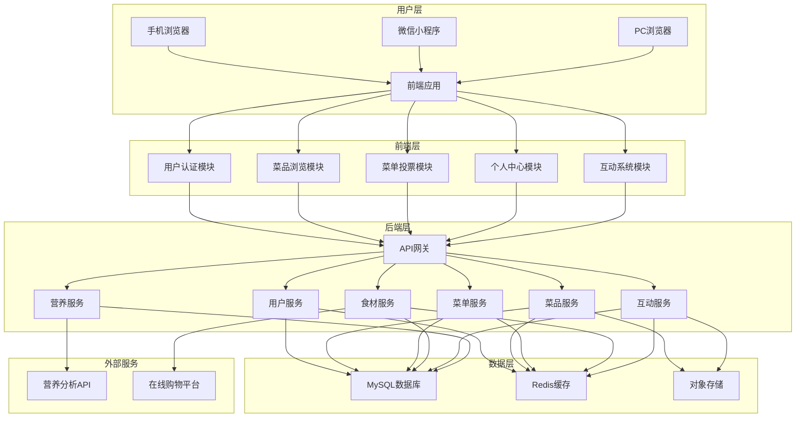
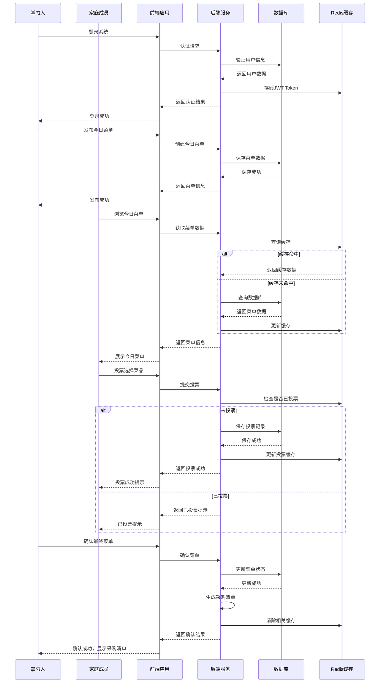
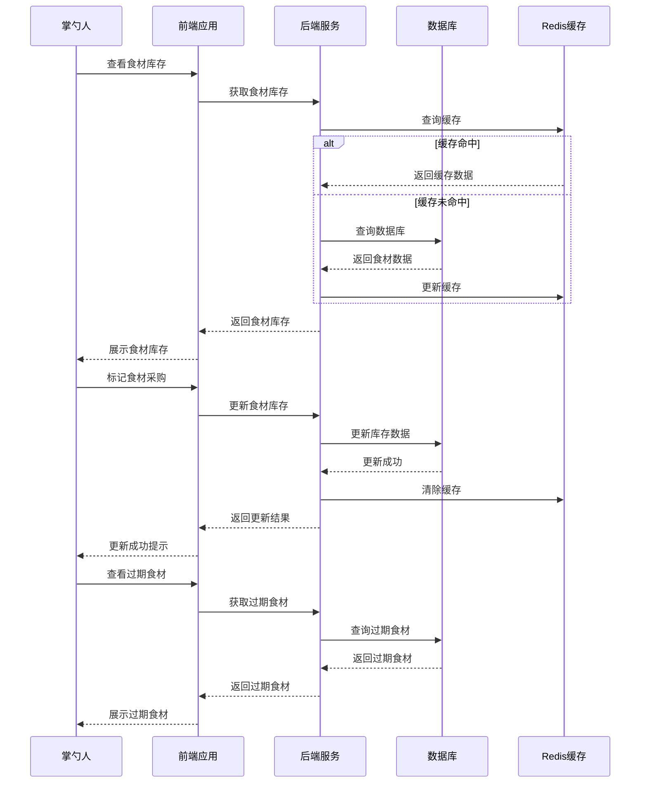

# FamilyEats (家庭智能点餐系统) 架构设计文档

## 1. 项目背景与目标

### 1.1 业务背景
"今天吃什么？"是每个家庭每天都会面临的终极难题。家庭成员口味各异，食材管理混乱，采购清单不完整，这些问题都给家庭生活带来了不必要的困扰。FamilyEats系统旨在通过智能化的方式，解决这些问题，让家庭饮食管理变得更加轻松、高效、有趣。

### 1.2 业务目标
- **解决决策难题**：通过智能推荐和家庭成员投票，快速确定每日菜单
- **优化食材管理**：实时掌握食材库存，减少浪费，避免重复购买
- **提升家庭互动**：通过游戏化和奖励机制，增加家庭成员参与度
- **健康饮食引导**：通过营养分析和健康建议，引导家庭成员形成健康的饮食习惯

### 1.3 技术目标
- **掌握全栈开发**：Spring Boot + Vue 3 前后端分离架构
- **实践企业级技术**：Redis缓存、Docker容器化部署、Git Flow工作流
- **提升代码质量**：遵循企业级代码规范，实现模块化、可扩展的系统架构
- **构建面试项目**：打造一个涵盖CRUD基础操作和高级特性的完整项目

## 2. 用户画像与核心需求分析

### 2.1 用户画像

| 用户角色 | 特点 | 痛点 | 核心需求 |
|---------|------|------|---------|
| **掌勺人/管理员** | 家庭饮食决策者，负责采购和烹饪 | 菜谱选择困难，食材管理混乱，采购遗忘 | 菜品管理，菜单发布，采购清单生成，后台管理 |
| **老年人** | 视力下降，操作不熟练，口味固定 | 界面复杂，操作困难，字体太小 | 关怀模式，极简操作，常用推荐，语音辅助 |
| **幼儿/小学生** | 挑食，喜欢有趣的事物，自制力差 | 不爱吃蔬菜，操作复杂，缺乏趣味性 | 游戏化界面，奖励机制，健康引导，限制机制 |
| **青少年/大学生** | 熟悉科技，追求新鲜事物，注重效率 | 夜宵需求，想吃新奇菜式，评价需求 | 许愿池，评价系统，快速操作，个性化推荐 |

### 2.2 功能需求分析

#### 2.2.1 核心功能模块

| 模块名称 | 功能描述 | 目标用户 | 优先级 |
|---------|---------|---------|--------|
| **用户认证与管理** | 用户注册登录，角色分配，个人信息管理 | 所有用户 | 高 |
| **菜品管理** | 菜品录入、编辑、删除、分类，图片上传 | 掌勺人 | 高 |
| **菜单管理** | 今日菜单发布，菜品投票，最终菜单确认 | 所有用户 | 高 |
| **食材管理** | 食材库存管理，采购清单生成，过期提醒 | 掌勺人 | 高 |
| **互动系统** | 许愿池，评价系统，排行榜，奖励机制 | 所有用户 | 中 |
| **营养分析** | 膳食营养评估，健康建议，特殊饮食管理 | 所有用户 | 中 |
| **系统设置** | 界面设置，通知管理，数据备份 | 掌勺人 | 中 |

#### 2.2.2 非功能需求

| 需求类型 | 具体要求 | 实现方案 |
|---------|---------|---------|
| **性能需求** | 页面加载时间 < 2秒，API响应时间 < 500ms | 前端缓存，Redis缓存，数据库索引优化 |
| **可用性需求** | 系统可用性 > 99.9%，支持离线使用 | 多端同步，本地存储，容错设计 |
| **安全性需求** | 数据加密，权限控制，防止SQL注入 | Spring Security，JWT认证，参数校验 |
| **兼容性需求** | 支持主流浏览器和移动设备，响应式设计 | 响应式布局，多端适配，浏览器兼容性测试 |
| **可扩展性需求** | 支持功能扩展，模块解耦，易于维护 | 模块化设计，微服务架构思想，依赖注入 |

## 3. 技术架构设计

### 3.1 技术栈选型

| 分类 | 技术 | 版本 | 选型理由 |
|------|------|------|---------|
| **前端** | Vue 3 | 3.4.x | 响应式框架，组合式API，性能优异 |
| **前端构建** | Vite | 5.0.x | 快速的开发服务器，优化的构建工具 |
| **UI框架** | Vant UI | 4.8.x | 移动端优先，组件丰富，适合家庭成员使用 |
| **UI框架** | Element Plus | 2.5.x | PC端管理界面，组件全面，易于使用 |
| **状态管理** | Pinia | 2.1.x | Vue 3官方推荐，轻量级，易于使用 |
| **路由** | Vue Router | 4.2.x | Vue官方路由，支持动态路由，导航守卫 |
| **HTTP客户端** | Axios | 1.6.x | 功能强大，支持拦截器，易于使用 |
| **后端** | Spring Boot | 3.5.x | 简化配置，内置Tomcat，生态成熟 |
| **ORM框架** | MyBatis-Plus | 3.5.x | 开发效率高，功能丰富，易于使用 |
| **数据库** | MySQL | 8.0.x | 稳定可靠，适合关系型数据存储，社区活跃 |
| **缓存** | Redis | 7.0.x | 高性能缓存，支持多种数据结构，适合热点数据存储 |
| **认证授权** | Spring Security | 6.2.x | 安全可靠的认证授权机制，支持JWT |
| **工具库** | Lombok | 1.18.x | 简化代码，减少样板代码 |
| **工具库** | Hutool | 5.8.x | 丰富的Java工具类，提高开发效率 |
| **容器化** | Docker | 20.04.x | 简化部署，环境一致性，易于扩展 |
| **API文档** | SpringDoc OpenAPI | 2.3.x | 自动生成API文档，便于前端对接 |

### 3.2 系统架构图



### 3.3 系统分层设计

#### 3.3.1 前端分层

| 层级 | 职责 | 技术实现 | 文件位置 |
|------|------|---------|---------|
| **表现层** | 页面展示，用户交互 | Vue组件，Vant UI，Element Plus | src/components，src/views |
| **业务逻辑层** | 前端业务逻辑，状态管理 | Pinia，Vue Composition API | src/stores，src/utils |
| **数据访问层** | API调用，数据处理 | Axios，拦截器 | src/api，src/services |
| **路由层** | 页面导航，权限控制 | Vue Router，导航守卫 | src/router |
| **工具层** | 通用工具，常量定义 | 自定义工具类 | src/utils，src/constants |

#### 3.3.2 后端分层

| 层级 | 职责 | 技术实现 | 文件位置 |
|------|------|---------|---------|
| **控制层** | 请求接收，响应处理 | @RestController，@RequestMapping | src/main/java/com/familyeats/controller |
| **服务层** | 业务逻辑处理 | @Service，事务管理 | src/main/java/com/familyeats/service |
| **数据访问层** | 数据库操作 | MyBatis-Plus，@Mapper | src/main/java/com/familyeats/mapper |
| **模型层** | 数据模型定义 | @Entity，@Table | src/main/java/com/familyeats/model |
| **DTO层** | 数据传输对象 | 自定义DTO类 | src/main/java/com/familyeats/dto |
| **配置层** | 系统配置，Bean定义 | @Configuration，@Bean | src/main/java/com/familyeats/config |
| **工具层** | 通用工具，异常处理 | 自定义工具类，@ControllerAdvice | src/main/java/com/familyeats/utils，src/main/java/com/familyeats/exception |
| **安全层** | 认证授权，权限控制 | Spring Security，JWT | src/main/java/com/familyeats/security |

### 3.4 核心流程图

#### 3.4.1 每日点餐流程



#### 3.4.2 食材管理流程



## 4. 数据库设计

### 4.1 数据库表结构

#### 4.1.1 用户表 (sys_user)

| 字段名 | 数据类型 | 约束 | 描述 |
|-------|---------|------|------|
| `id` | `BIGINT` | `PRIMARY KEY, AUTO_INCREMENT` | 用户ID |
| `username` | `VARCHAR(50)` | `UNIQUE, NOT NULL` | 用户名 |
| `password` | `VARCHAR(100)` | `NOT NULL` | 密码（加密存储） |
| `nickname` | `VARCHAR(50)` | `NOT NULL` | 昵称 |
| `role` | `ENUM('admin', 'elder', 'child', 'teenager')` | `NOT NULL` | 角色 |
| `avatar` | `VARCHAR(255)` | | 头像URL |
| `phone` | `VARCHAR(20)` | | 手机号 |
| `email` | `VARCHAR(100)` | | 邮箱 |
| `preferences` | `JSON` | | 个人偏好（JSON格式） |
| `created_at` | `DATETIME` | `NOT NULL, DEFAULT CURRENT_TIMESTAMP` | 创建时间 |
| `updated_at` | `DATETIME` | `NOT NULL, DEFAULT CURRENT_TIMESTAMP ON UPDATE CURRENT_TIMESTAMP` | 更新时间 |

#### 4.1.2 菜品表 (dish)

| 字段名 | 数据类型 | 约束 | 描述 |
|-------|---------|------|------|
| `id` | `BIGINT` | `PRIMARY KEY, AUTO_INCREMENT` | 菜品ID |
| `name` | `VARCHAR(100)` | `NOT NULL` | 菜品名称 |
| `description` | `TEXT` | | 菜品描述 |
| `image_url` | `VARCHAR(255)` | | 菜品图片URL |
| `video_url` | `VARCHAR(255)` | | 菜品视频URL |
| `type` | `ENUM('meat', 'vegetable', 'soup', 'staple', 'dessert')` | `NOT NULL` | 菜品类型 |
| `difficulty` | `ENUM('easy', 'medium', 'hard')` | `NOT NULL` | 难度等级 |
| `cook_time` | `INT` | `NOT NULL` | 烹饪时间（分钟） |
| `health_score` | `INT` | `DEFAULT 0` | 健康评分（0-100） |
| `spiciness` | `INT` | `DEFAULT 0` | 辣度（0-5） |
| `sweetness` | `INT` | `DEFAULT 0` | 甜度（0-5） |
| `creator_id` | `BIGINT` | `FOREIGN KEY REFERENCES sys_user(id)` | 创建者ID |
| `created_at` | `DATETIME` | `NOT NULL, DEFAULT CURRENT_TIMESTAMP` | 创建时间 |
| `updated_at` | `DATETIME` | `NOT NULL, DEFAULT CURRENT_TIMESTAMP ON UPDATE CURRENT_TIMESTAMP` | 更新时间 |

#### 4.1.3 食材表 (ingredient)

| 字段名 | 数据类型 | 约束 | 描述 |
|-------|---------|------|------|
| `id` | `BIGINT` | `PRIMARY KEY, AUTO_INCREMENT` | 食材ID |
| `name` | `VARCHAR(100)` | `NOT NULL` | 食材名称 |
| `category` | `ENUM('vegetable', 'meat', 'seafood', 'grain', 'dairy', 'seasoning', 'other')` | `NOT NULL` | 食材分类 |
| `unit` | `VARCHAR(20)` | `NOT NULL` | 计量单位 |
| `stock_quantity` | `DECIMAL(10,2)` | `DEFAULT 0` | 库存数量 |
| `min_stock` | `DECIMAL(10,2)` | `DEFAULT 0` | 最小库存预警 |
| `expiry_date` | `DATE` | | 过期日期 |
| `purchase_date` | `DATE` | | 采购日期 |
| `price` | `DECIMAL(10,2)` | | 参考价格 |
| `created_at` | `DATETIME` | `NOT NULL, DEFAULT CURRENT_TIMESTAMP` | 创建时间 |
| `updated_at` | `DATETIME` | `NOT NULL, DEFAULT CURRENT_TIMESTAMP ON UPDATE CURRENT_TIMESTAMP` | 更新时间 |

#### 4.1.4 菜品食材关联表 (dish_ingredient)

| 字段名 | 数据类型 | 约束 | 描述 |
|-------|---------|------|------|
| `id` | `BIGINT` | `PRIMARY KEY, AUTO_INCREMENT` | 关联ID |
| `dish_id` | `BIGINT` | `FOREIGN KEY REFERENCES dish(id)` | 菜品ID |
| `ingredient_id` | `BIGINT` | `FOREIGN KEY REFERENCES ingredient(id)` | 食材ID |
| `quantity` | `DECIMAL(10,2)` | `NOT NULL` | 所需数量 |
| `created_at` | `DATETIME` | `NOT NULL, DEFAULT CURRENT_TIMESTAMP` | 创建时间 |

#### 4.1.5 每日菜单表 (daily_menu)

| 字段名 | 数据类型 | 约束 | 描述 |
|-------|---------|------|------|
| `id` | `BIGINT` | `PRIMARY KEY, AUTO_INCREMENT` | 菜单ID |
| `menu_date` | `DATE` | `NOT NULL, UNIQUE` | 菜单日期 |
| `status` | `ENUM('draft', 'voting', 'confirmed', 'completed')` | `NOT NULL, DEFAULT 'draft'` | 菜单状态 |
| `creator_id` | `BIGINT` | `FOREIGN KEY REFERENCES sys_user(id)` | 创建者ID |
| `notes` | `TEXT` | | 备注信息 |
| `created_at` | `DATETIME` | `NOT NULL, DEFAULT CURRENT_TIMESTAMP` | 创建时间 |
| `updated_at` | `DATETIME` | `NOT NULL, DEFAULT CURRENT_TIMESTAMP ON UPDATE CURRENT_TIMESTAMP` | 更新时间 |

#### 4.1.6 菜单菜品关联表 (menu_item)

| 字段名 | 数据类型 | 约束 | 描述 |
|-------|---------|------|------|
| `id` | `BIGINT` | `PRIMARY KEY, AUTO_INCREMENT` | 关联ID |
| `menu_id` | `BIGINT` | `FOREIGN KEY REFERENCES daily_menu(id)` | 菜单ID |
| `dish_id` | `BIGINT` | `FOREIGN KEY REFERENCES dish(id)` | 菜品ID |
| `votes` | `INT` | `DEFAULT 0` | 得票数 |
| `is_confirmed` | `BOOLEAN` | `DEFAULT FALSE` | 是否确认入选 |
| `created_at` | `DATETIME` | `NOT NULL, DEFAULT CURRENT_TIMESTAMP` | 创建时间 |
| `updated_at` | `DATETIME` | `NOT NULL, DEFAULT CURRENT_TIMESTAMP ON UPDATE CURRENT_TIMESTAMP` | 更新时间 |

#### 4.1.7 投票记录表 (vote_record)

| 字段名 | 数据类型 | 约束 | 描述 |
|-------|---------|------|------|
| `id` | `BIGINT` | `PRIMARY KEY, AUTO_INCREMENT` | 记录ID |
| `menu_id` | `BIGINT` | `FOREIGN KEY REFERENCES daily_menu(id)` | 菜单ID |
| `dish_id` | `BIGINT` | `FOREIGN KEY REFERENCES dish(id)` | 菜品ID |
| `user_id` | `BIGINT` | `FOREIGN KEY REFERENCES sys_user(id)` | 用户ID |
| `created_at` | `DATETIME` | `NOT NULL, DEFAULT CURRENT_TIMESTAMP` | 投票时间 |
| `UNIQUE KEY` | `(menu_id, dish_id, user_id)` | | 确保用户对同一菜品只投一次 |

#### 4.1.8 许愿池表 (wish_pool)

| 字段名 | 数据类型 | 约束 | 描述 |
|-------|---------|------|------|
| `id` | `BIGINT` | `PRIMARY KEY, AUTO_INCREMENT` | 许愿ID |
| `user_id` | `BIGINT` | `FOREIGN KEY REFERENCES sys_user(id)` | 许愿用户ID |
| `wish_content` | `VARCHAR(255)` | `NOT NULL` | 许愿内容 |
| `status` | `ENUM('pending', 'approved', 'rejected', 'completed')` | `NOT NULL, DEFAULT 'pending'` | 许愿状态 |
| `image_url` | `VARCHAR(255)` | | 图片URL |
| `notes` | `TEXT` | | 备注信息 |
| `created_at` | `DATETIME` | `NOT NULL, DEFAULT CURRENT_TIMESTAMP` | 创建时间 |
| `updated_at` | `DATETIME` | `NOT NULL, DEFAULT CURRENT_TIMESTAMP ON UPDATE CURRENT_TIMESTAMP` | 更新时间 |

#### 4.1.9 评价表 (evaluation)

| 字段名 | 数据类型 | 约束 | 描述 |
|-------|---------|------|------|
| `id` | `BIGINT` | `PRIMARY KEY, AUTO_INCREMENT` | 评价ID |
| `menu_id` | `BIGINT` | `FOREIGN KEY REFERENCES daily_menu(id)` | 菜单ID |
| `dish_id` | `BIGINT` | `FOREIGN KEY REFERENCES dish(id)` | 菜品ID |
| `user_id` | `BIGINT` | `FOREIGN KEY REFERENCES sys_user(id)` | 评价用户ID |
| `rating` | `INT` | `NOT NULL` | 评分（1-5） |
| `content` | `TEXT` | | 评价内容 |
| `image_url` | `VARCHAR(255)` | | 图片URL |
| `created_at` | `DATETIME` | `NOT NULL, DEFAULT CURRENT_TIMESTAMP` | 创建时间 |
| `updated_at` | `DATETIME` | `NOT NULL, DEFAULT CURRENT_TIMESTAMP ON UPDATE CURRENT_TIMESTAMP` | 更新时间 |

#### 4.1.10 采购清单表 (shopping_list)

| 字段名 | 数据类型 | 约束 | 描述 |
|-------|---------|------|------|
| `id` | `BIGINT` | `PRIMARY KEY, AUTO_INCREMENT` | 清单ID |
| `menu_id` | `BIGINT` | `FOREIGN KEY REFERENCES daily_menu(id)` | 关联菜单ID |
| `name` | `VARCHAR(100)` | `NOT NULL` | 清单名称 |
| `status` | `ENUM('pending', 'purchasing', 'completed')` | `NOT NULL, DEFAULT 'pending'` | 清单状态 |
| `creator_id` | `BIGINT` | `FOREIGN KEY REFERENCES sys_user(id)` | 创建者ID |
| `total_amount` | `DECIMAL(10,2)` | `DEFAULT 0` | 预估总金额 |
| `created_at` | `DATETIME` | `NOT NULL, DEFAULT CURRENT_TIMESTAMP` | 创建时间 |
| `updated_at` | `DATETIME` | `NOT NULL, DEFAULT CURRENT_TIMESTAMP ON UPDATE CURRENT_TIMESTAMP` | 更新时间 |

#### 4.1.11 采购清单项目表 (shopping_item)

| 字段名 | 数据类型 | 约束 | 描述 |
|-------|---------|------|------|
| `id` | `BIGINT` | `PRIMARY KEY, AUTO_INCREMENT` | 项目ID |
| `list_id` | `BIGINT` | `FOREIGN KEY REFERENCES shopping_list(id)` | 清单ID |
| `ingredient_id` | `BIGINT` | `FOREIGN KEY REFERENCES ingredient(id)` | 食材ID |
| `quantity` | `DECIMAL(10,2)` | `NOT NULL` | 采购数量 |
| `unit_price` | `DECIMAL(10,2)` | | 单价 |
| `total_price` | `DECIMAL(10,2)` | | 总价 |
| `purchased` | `BOOLEAN` | `DEFAULT FALSE` | 是否已采购 |
| `notes` | `VARCHAR(255)` | | 备注信息 |
| `created_at` | `DATETIME` | `NOT NULL, DEFAULT CURRENT_TIMESTAMP` | 创建时间 |
| `updated_at` | `DATETIME` | `NOT NULL, DEFAULT CURRENT_TIMESTAMP ON UPDATE CURRENT_TIMESTAMP` | 更新时间 |

### 4.2 数据库索引设计

| 表名 | 索引类型 | 索引字段 | 目的 |
|------|---------|---------|------|
| `sys_user` | `UNIQUE` | `username` | 加速用户登录查询 |
| `sys_user` | `INDEX` | `role` | 按角色查询用户 |
| `dish` | `INDEX` | `type` | 按类型查询菜品 |
| `dish` | `INDEX` | `difficulty` | 按难度查询菜品 |
| `dish` | `INDEX` | `health_score` | 按健康评分排序 |
| `ingredient` | `INDEX` | `category` | 按分类查询食材 |
| `ingredient` | `INDEX` | `expiry_date` | 查找过期食材 |
| `daily_menu` | `UNIQUE` | `menu_date` | 确保每日只有一个菜单 |
| `daily_menu` | `INDEX` | `status` | 按状态查询菜单 |
| `menu_item` | `INDEX` | `(menu_id, is_confirmed)` | 快速查询确认的菜品 |
| `vote_record` | `UNIQUE` | `(menu_id, dish_id, user_id)` | 防止重复投票 |
| `evaluation` | `INDEX` | `(menu_id, dish_id)` | 按菜品查询评价 |
| `evaluation` | `INDEX` | `rating` | 按评分排序 |
| `shopping_list` | `INDEX` | `status` | 按状态查询采购清单 |
| `shopping_item` | `INDEX` | `(list_id, purchased)` | 按清单和采购状态查询 |

### 4.3 数据字典

#### 4.3.1 角色类型

| 角色代码 | 角色名称 | 权限描述 |
|---------|---------|---------|
| `admin` | 管理员/掌勺人 | 拥有所有权限，包括用户管理、菜品管理、菜单管理、食材管理等 |
| `elder` | 老年人 | 有限权限，只能浏览菜单、投票、评价，不能修改系统设置 |
| `child` | 儿童 | 有限权限，只能浏览菜单、投票、评价，带有特殊的游戏化界面 |
| `teenager` | 青少年 | 标准权限，可以浏览菜单、投票、评价、许愿，不能修改系统设置 |

#### 4.3.2 菜品类型

| 类型代码 | 类型名称 | 描述 |
|---------|---------|------|
| `meat` | 荤菜 | 以肉类为主的菜品 |
| `vegetable` | 素菜 | 以蔬菜为主的菜品 |
| `soup` | 汤类 | 各种汤品 |
| `staple` | 主食 | 米饭、面条、馒头等 |
| `dessert` | 甜点 | 各种甜品 |

#### 4.3.3 菜单状态

| 状态代码 | 状态名称 | 描述 |
|---------|---------|------|
| `draft` | 草稿 | 菜单正在创建中，尚未发布 |
| `voting` | 投票中 | 菜单已发布，家庭成员正在投票 |
| `confirmed` | 已确认 | 投票结束，掌勺人已确认最终菜单 |
| `completed` | 已完成 | 菜单已执行，菜品已烹饪完成 |

## 5. API 接口设计

### 5.1 接口规范

#### 5.1.1 基本格式

| 项目 | 格式 | 示例 |
|------|------|------|
| **请求方法** | RESTful风格 | GET, POST, PUT, DELETE |
| **URL格式** | `/api/{模块}/{版本}/{资源}` | `/api/user/v1/login` |
| **请求体** | JSON格式 | `{"username": "admin", "password": "123456"}` |
| **响应格式** | 统一JSON格式 | `{"code": 200, "data": {...}, "message": "success"}` |
| **错误处理** | 统一错误码 | `{"code": 401, "data": null, "message": "未授权"}` |

#### 5.1.2 响应状态码

| 状态码 | 描述 | 含义 |
|-------|------|------|
| `200` | `OK` | 请求成功 |
| `400` | `Bad Request` | 请求参数错误 |
| `401` | `Unauthorized` | 未授权，需要登录 |
| `403` | `Forbidden` | 权限不足 |
| `404` | `Not Found` | 资源不存在 |
| `500` | `Internal Server Error` | 服务器内部错误 |

### 5.2 核心接口设计

#### 5.2.1 用户认证模块

| API路径 | 方法 | 模块 | 功能 | 请求体 (JSON) | 成功响应 (200 OK) |
|---------|------|------|------|--------------|------------------|
| `/api/auth/v1/login` | `POST` | 认证 | 用户登录 | `{"username": "admin", "password": "123456"}` | `{"code": 200, "data": {"token": "...", "user": {...}}, "message": "success"}` |
| `/api/auth/v1/logout` | `POST` | 认证 | 用户登出 | N/A | `{"code": 200, "data": null, "message": "success"}` |
| `/api/auth/v1/refresh` | `POST` | 认证 | 刷新Token | `{"token": "..."}` | `{"code": 200, "data": {"token": "..."}, "message": "success"}` |
| `/api/user/v1` | `GET` | 用户管理 | 获取用户列表 | N/A | `{"code": 200, "data": [{"id": 1, "username": "admin", ...}], "message": "success"}` |
| `/api/user/v1` | `POST` | 用户管理 | 创建用户 | `{"username": "user1", "password": "123456", "role": "teenager"}` | `{"code": 200, "data": {"id": 2, "username": "user1", ...}, "message": "success"}` |
| `/api/user/v1/{id}` | `GET` | 用户管理 | 获取用户详情 | N/A | `{"code": 200, "data": {"id": 1, "username": "admin", ...}, "message": "success"}` |
| `/api/user/v1/{id}` | `PUT` | 用户管理 | 更新用户信息 | `{"nickname": "新昵称", "phone": "13800138000"}` | `{"code": 200, "data": {"id": 1, "nickname": "新昵称", ...}, "message": "success"}` |
| `/api/user/v1/{id}` | `DELETE` | 用户管理 | 删除用户 | N/A | `{"code": 200, "data": null, "message": "success"}` |
| `/api/user/v1/preference` | `GET` | 用户管理 | 获取个人偏好 | N/A | `{"code": 200, "data": {"favoriteDishes": [...], "dietaryRestrictions": [...]}, "message": "success"}` |
| `/api/user/v1/preference` | `PUT` | 用户管理 | 更新个人偏好 | `{"favoriteDishes": [1, 2, 3], "dietaryRestrictions": ["辣"]}` | `{"code": 200, "data": {"favoriteDishes": [1, 2, 3], ...}, "message": "success"}` |

#### 5.2.2 菜品管理模块

| API路径 | 方法 | 模块 | 功能 | 请求体 (JSON) | 成功响应 (200 OK) |
|---------|------|------|------|--------------|------------------|
| `/api/dish/v1` | `GET` | 菜品管理 | 获取菜品列表 | N/A | `{"code": 200, "data": [{"id": 1, "name": "宫保鸡丁", ...}], "message": "success"}` |
| `/api/dish/v1` | `POST` | 菜品管理 | 创建菜品 | `{"name": "鱼香肉丝", "type": "meat", "difficulty": "medium", "cookTime": 20, "ingredients": [...]}` | `{"code": 200, "data": {"id": 2, "name": "鱼香肉丝", ...}, "message": "success"}` |
| `/api/dish/v1/{id}` | `GET` | 菜品管理 | 获取菜品详情 | N/A | `{"code": 200, "data": {"id": 1, "name": "宫保鸡丁", "ingredients": [...], ...}, "message": "success"}` |
| `/api/dish/v1/{id}` | `PUT` | 菜品管理 | 更新菜品信息 | `{"name": "宫保鸡丁（改良版）", "difficulty": "easy"}` | `{"code": 200, "data": {"id": 1, "name": "宫保鸡丁（改良版）", ...}, "message": "success"}` |
| `/api/dish/v1/{id}` | `DELETE` | 菜品管理 | 删除菜品 | N/A | `{"code": 200, "data": null, "message": "success"}` |
| `/api/dish/v1/search` | `GET` | 菜品管理 | 搜索菜品 | N/A (查询参数: keyword, type, difficulty) | `{"code": 200, "data": [{"id": 1, "name": "宫保鸡丁", ...}], "message": "success"}` |
| `/api/dish/v1/recommend` | `GET` | 菜品管理 | 获取推荐菜品 | N/A | `{"code": 200, "data": [{"id": 1, "name": "宫保鸡丁", ...}], "message": "success"}` |
| `/api/dish/v1/upload` | `POST` | 菜品管理 | 上传菜品图片 | `multipart/form-data` | `{"code": 200, "data": {"url": "..."}, "message": "success"}` |

#### 5.2.3 菜单管理模块

| API路径 | 方法 | 模块 | 功能 | 请求体 (JSON) | 成功响应 (200 OK) |
|---------|------|------|------|--------------|------------------|
| `/api/menu/v1` | `GET` | 菜单管理 | 获取菜单列表 | N/A (查询参数: startDate, endDate, status) | `{"code": 200, "data": [{"id": 1, "menuDate": "2024-01-01", ...}], "message": "success"}` |
| `/api/menu/v1` | `POST` | 菜单管理 | 创建菜单 | `{"menuDate": "2024-01-01", "dishIds": [1, 2, 3]}` | `{"code": 200, "data": {"id": 1, "menuDate": "2024-01-01", ...}, "message": "success"}` |
| `/api/menu/v1/{id}` | `GET` | 菜单管理 | 获取菜单详情 | N/A | `{"code": 200, "data": {"id": 1, "menuDate": "2024-01-01", "items": [...]}, "message": "success"}` |
| `/api/menu/v1/{id}` | `PUT` | 菜单管理 | 更新菜单 | `{"status": "confirmed", "confirmedDishIds": [1, 2]}` | `{"code": 200, "data": {"id": 1, "status": "confirmed", ...}, "message": "success"}` |
| `/api/menu/v1/{id}` | `DELETE` | 菜单管理 | 删除菜单 | N/A | `{"code": 200, "data": null, "message": "success"}` |
| `/api/menu/v1/today` | `GET` | 菜单管理 | 获取今日菜单 | N/A | `{"code": 200, "data": {"id": 1, "menuDate": "2024-01-01", "items": [...]}, "message": "success"}` |
| `/api/menu/v1/vote` | `POST` | 菜单管理 | 菜品投票 | `{"menuId": 1, "dishId": 1}` | `{"code": 200, "data": {"votes": 5}, "message": "success"}` |
| `/api/menu/v1/{id}/shopping-list` | `GET` | 菜单管理 | 生成采购清单 | N/A | `{"code": 200, "data": {"id": 1, "items": [{"ingredient": {...}, "quantity": 2}]}, "message": "success"}` |

#### 5.2.4 食材管理模块

| API路径 | 方法 | 模块 | 功能 | 请求体 (JSON) | 成功响应 (200 OK) |
|---------|------|------|------|--------------|------------------|
| `/api/ingredient/v1` | `GET` | 食材管理 | 获取食材列表 | N/A | `{"code": 200, "data": [{"id": 1, "name": "西红柿", "stockQuantity": 5, ...}], "message": "success"}` |
| `/api/ingredient/v1` | `POST` | 食材管理 | 创建食材 | `{"name": "鸡蛋", "category": "other", "unit": "个", "stockQuantity": 10}` | `{"code": 200, "data": {"id": 2, "name": "鸡蛋", ...}, "message": "success"}` |
| `/api/ingredient/v1/{id}` | `GET` | 食材管理 | 获取食材详情 | N/A | `{"code": 200, "data": {"id": 1, "name": "西红柿", "stockQuantity": 5, ...}, "message": "success"}` |
| `/api/ingredient/v1/{id}` | `PUT` | 食材管理 | 更新食材信息 | `{"stockQuantity": 3, "expiryDate": "2024-01-10"}` | `{"code": 200, "data": {"id": 1, "stockQuantity": 3, ...}, "message": "success"}` |
| `/api/ingredient/v1/{id}` | `DELETE` | 食材管理 | 删除食材 | N/A | `{"code": 200, "data": null, "message": "success"}` |
| `/api/ingredient/v1/expiring` | `GET` | 食材管理 | 获取即将过期的食材 | N/A | `{"code": 200, "data": [{"id": 1, "name": "西红柿", "expiryDate": "2024-01-05", ...}], "message": "success"}` |
| `/api/ingredient/v1/low-stock` | `GET` | 食材管理 | 获取库存不足的食材 | N/A | `{"code": 200, "data": [{"id": 2, "name": "鸡蛋", "stockQuantity": 1, "minStock": 5, ...}], "message": "success"}` |
| `/api/ingredient/v1/batch-update` | `POST` | 食材管理 | 批量更新食材库存 | `[{"id": 1, "stockQuantity": 5}, {"id": 2, "stockQuantity": 10}]` | `{"code": 200, "data": null, "message": "success"}` |

#### 5.2.5 互动系统模块

| API路径 | 方法 | 模块 | 功能 | 请求体 (JSON) | 成功响应 (200 OK) |
|---------|------|------|------|--------------|------------------|
| `/api/interaction/v1/wish` | `GET` | 互动系统 | 获取许愿池列表 | N/A | `{"code": 200, "data": [{"id": 1, "content": "想吃火锅", "status": "pending", ...}], "message": "success"}` |
| `/api/interaction/v1/wish` | `POST` | 互动系统 | 提交许愿 | `{"content": "想吃火锅", "imageUrl": "..."}` | `{"code": 200, "data": {"id": 1, "content": "想吃火锅", ...}, "message": "success"}` |
| `/api/interaction/v1/wish/{id}` | `PUT` | 互动系统 | 更新许愿状态 | `{"status": "approved", "notes": "周末安排"}` | `{"code": 200, "data": {"id": 1, "status": "approved", ...}, "message": "success"}` |
| `/api/interaction/v1/evaluation` | `GET` | 互动系统 | 获取评价列表 | N/A | `{"code": 200, "data": [{"id": 1, "dishId": 1, "rating": 5, "content": "好吃", ...}], "message": "success"}` |
| `/api/interaction/v1/evaluation` | `POST` | 互动系统 | 提交评价 | `{"menuId": 1, "dishId": 1, "rating": 5, "content": "好吃极了"}` | `{"code": 200, "data": {"id": 1, "rating": 5, ...}, "message": "success"}` |
| `/api/interaction/v1/ranking/dish` | `GET` | 互动系统 | 获取菜品排行榜 | N/A | `{"code": 200, "data": [{"dishId": 1, "dishName": "宫保鸡丁", "score": 100, ...}], "message": "success"}` |
| `/api/interaction/v1/ranking/user` | `GET` | 互动系统 | 获取用户排行榜 | N/A | `{"code": 200, "data": [{"userId": 1, "username": "admin", "score": 80, ...}], "message": "success"}` |

#### 5.2.6 营养分析模块

| API路径 | 方法 | 模块 | 功能 | 请求体 (JSON) | 成功响应 (200 OK) |
|---------|------|------|------|--------------|------------------|
| `/api/nutrition/v1/analyze/dish` | `POST` | 营养分析 | 分析菜品营养 | `{"dishId": 1}` | `{"code": 200, "data": {"calories": 350, "protein": 25, "carbs": 40, "fat": 15}, "message": "success"}` |
| `/api/nutrition/v1/analyze/menu` | `POST` | 营养分析 | 分析菜单营养 | `{"menuId": 1}` | `{"code": 200, "data": {"totalCalories": 1200, "nutritionBreakdown": {...}}, "message": "success"}` |
| `/api/nutrition/v1/advice` | `GET` | 营养分析 | 获取健康建议 | N/A | `{"code": 200, "data": {"advice": "建议增加蔬菜摄入", "target": "all"}, "message": "success"}` |
| `/api/nutrition/v1/track` | `POST` | 营养分析 | 记录营养摄入 | `{"foods": [{"name": "宫保鸡丁", "amount": 100}], "date": "2024-01-01"}` | `{"code": 200, "data": {"totalCalories": 350, ...}, "message": "success"}` |
| `/api/nutrition/v1/report` | `GET` | 营养分析 | 获取营养报告 | N/A (查询参数: startDate, endDate) | `{"code": 200, "data": {"averageCalories": 1800, "nutritionTrends": {...}}, "message": "success"}` |

## 5. 前端设计

### 5.1 前端技术栈

| 技术 | 版本 | 用途 | 选型理由 |
|------|------|------|---------|
| **Vue** | 3.4.x | 前端框架 | 响应式设计，组合式API，性能优异 |
| **Vite** | 5.0.x | 构建工具 | 快速的开发服务器，优化的构建过程 |
| **Vant UI** | 4.8.x | 移动端UI组件库 | 轻量级，组件丰富，适合移动端使用 |
| **Element Plus** | 2.5.x | PC端UI组件库 | 功能全面，适合后台管理界面 |
| **Pinia** | 2.1.x | 状态管理 | Vue 3官方推荐，轻量级，易于使用 |
| **Vue Router** | 4.2.x | 路由管理 | 官方路由，支持动态路由和导航守卫 |
| **Axios** | 1.6.x | HTTP客户端 | 功能强大，支持拦截器和请求配置 |
| **Day.js** | 1.11.x | 日期处理 | 轻量级，API友好，替代Moment.js |
| **ECharts** | 5.4.x | 数据可视化 | 功能强大，图表类型丰富 |
| **Vue-i18n** | 9.8.x | 国际化 | 支持多语言，易于集成 |

### 5.2 前端项目结构

```
family-eats-frontend/
├── public/              # 静态资源
│   ├── favicon.ico
│   └── index.html
├── src/
│   ├── assets/          # 资源文件
│   │   ├── images/      # 图片资源
│   │   ├── styles/      # 样式文件
│   │   └── icons/       # 图标资源
│   ├── components/      # 通用组件
│   │   ├── common/      # 基础组件
│   │   ├── layout/      # 布局组件
│   │   └── business/    # 业务组件
│   ├── views/           # 页面视图
│   │   ├── auth/        # 认证相关页面
│   │   ├── dish/        # 菜品相关页面
│   │   ├── menu/        # 菜单相关页面
│   │   ├── ingredient/  # 食材相关页面
│   │   ├── interaction/ # 互动相关页面
│   │   ├── nutrition/   # 营养分析页面
│   │   └── user/        # 用户相关页面
│   ├── router/          # 路由配置
│   │   └── index.js
│   ├── stores/          # 状态管理
│   │   ├── user.js
│   │   ├── dish.js
│   │   ├── menu.js
│   │   └── ingredient.js
│   ├── api/             # API调用
│   │   ├── auth.js
│   │   ├── dish.js
│   │   ├── menu.js
│   │   └── ingredient.js
│   ├── utils/           # 工具函数
│   │   ├── request.js   # Axios封装
│   │   ├── storage.js   # 存储工具
│   │   └── validator.js # 验证工具
│   ├── constants/       # 常量定义
│   │   └── index.js
│   ├── hooks/           # 自定义钩子
│   │   └── index.js
│   ├── App.vue          # 根组件
│   └── main.js          # 入口文件
├── .env.development     # 开发环境配置
├── .env.production      # 生产环境配置
├── vite.config.js       # Vite配置
├── package.json         # 项目依赖
└── README.md            # 项目说明
```

### 5.3 页面设计

#### 5.3.1 核心页面

| 页面名称 | 主要功能 | 目标用户 | 设计特点 | 路由路径 |
|---------|---------|---------|---------|---------|
| **登录页** | 用户登录，注册，忘记密码 | 所有用户 | 简洁明了，支持微信登录 | `/auth/login` |
| **首页** | 今日菜单，快捷操作，通知中心 | 所有用户 | 个性化布局，根据用户类型调整 | `/` |
| **菜品浏览页** | 菜品列表，分类筛选，搜索 | 所有用户 | 大图展示，流畅滑动 | `/dish/list` |
| **菜品详情页** | 菜品详情，食材列表，步骤展示 | 所有用户 | 图文并茂，步骤清晰 | `/dish/detail/:id` |
| **今日菜单页** | 今日菜品，投票，评价 | 所有用户 | 突出投票功能，实时更新 | `/menu/today` |
| **菜单历史页** | 历史菜单，统计分析 | 所有用户 | 日历视图，数据可视化 | `/menu/history` |
| **食材管理页** | 食材库存，过期提醒，采购清单 | 掌勺人 | 表格展示，批量操作 | `/ingredient/manage` |
| **互动中心页** | 许愿池，排行榜，评价 | 所有用户 | 游戏化设计，奖励机制 | `/interaction/center` |
| **营养分析页** | 营养报告，健康建议 | 所有用户 | 图表展示，直观清晰 | `/nutrition/report` |
| **个人中心页** | 个人信息，偏好设置，角色切换 | 所有用户 | 个性化设置，角色专属功能 | `/user/profile` |
| **后台管理页** | 用户管理，系统设置，数据统计 | 掌勺人 | 功能全面，操作便捷 | `/admin/dashboard` |

#### 5.3.2 特殊页面

| 页面名称 | 主要功能 | 目标用户 | 设计特点 | 路由路径 |
|---------|---------|---------|---------|---------|
| **老人模式页** | 简化版界面，大字体，大按钮 | 老年人 | 字体超大，图片超大，简化操作 | `/elder/home` |
| **儿童模式页** | 游戏化界面，奖励机制 | 儿童 | 卡通风格，互动元素，奖励动画 | `/child/home` |
| **采购清单页** | 食材采购清单，在线购物 | 掌勺人 | 可编辑，支持分享，在线购物链接 | `/shopping/list` |
| **许愿池页** | 提交许愿，查看许愿状态 | 青少年，儿童 | 创意设计，状态追踪 | `/interaction/wish` |

### 5.4 交互设计

#### 5.4.1 通用交互原则

| 原则 | 描述 | 实现方式 |
|------|------|---------|
| **一致性** | 保持界面元素和操作的一致性 | 使用统一的组件库，遵循统一的设计规范 |
| **反馈及时** | 对用户操作提供及时的视觉反馈 | 加载动画，成功/失败提示，按钮状态变化 |
| **简化操作** | 减少操作步骤，优化操作流程 | 批量操作，快捷入口，智能推荐 |
| **容错处理** | 防止用户误操作，提供撤销机制 | 确认对话框，自动保存，操作历史 |
| **个性化** | 根据用户角色和偏好调整界面 | 角色专属界面，个性化推荐，主题设置 |

#### 5.4.2 角色专属交互

| 角色 | 交互特点 | 实现方式 |
|------|---------|---------|
| **掌勺人/管理员** | 高效操作，批量处理 | 后台管理界面，批量操作按钮，快捷入口 |
| **老年人** | 大字体，大按钮，简化操作 | 关怀模式，字体放大，简化导航，语音辅助 |
| **幼儿/小学生** | 游戏化，奖励机制，简单操作 | 儿童模式，卡通风格，滑动操作，奖励动画 |
| **青少年/大学生** | 快捷操作，个性化设置 | 快捷菜单，个性化推荐，社交分享 |

#### 5.4.3 响应式设计

| 设备类型 | 屏幕尺寸 | 布局策略 | 适配措施 |
|---------|---------|---------|---------|
| **手机** | < 768px | 单列布局，底部导航 | 简化界面，优先展示核心功能 |
| **平板** | 768px - 1024px | 双列布局，侧边导航 | 适当增加信息密度，保持操作便捷 |
| **PC** | > 1024px | 多列布局，顶部导航 | 完整功能展示，数据表格，高级筛选 |

### 5.5 状态管理设计

#### 5.5.1 核心Store

| Store名称 | 管理状态 | 主要方法 | 持久化 |
|---------|---------|---------|---------|
| **UserStore** | 用户信息，登录状态，权限 | `login()`, `logout()`, `updateUser()` | 本地存储 + Session Storage |
| **DishStore** | 菜品列表，分类，搜索结果 | `getDishes()`, `searchDishes()`, `getDishDetail()` | 内存缓存 |
| **MenuStore** | 今日菜单，历史菜单，投票状态 | `getTodayMenu()`, `voteDish()`, `confirmMenu()` | 内存缓存 |
| **IngredientStore** | 食材库存，过期提醒，采购清单 | `getIngredients()`, `updateStock()`, `getExpiringIngredients()` | 内存缓存 |
| **InteractionStore** | 许愿池，评价，排行榜 | `submitWish()`, `submitEvaluation()`, `getRankings()` | 内存缓存 |
| **NutritionStore** | 营养分析，健康建议 | `analyzeNutrition()`, `getHealthAdvice()`, `getReport()` | 内存缓存 |

#### 5.5.2 持久化策略

| 存储方式 | 适用场景 | 实现方式 | 优点 |
|---------|---------|---------|------|
| **Local Storage** | 用户偏好，主题设置 | `localStorage.setItem()`, `localStorage.getItem()` | 持久化存储，容量较大 |
| **Session Storage** | 登录状态，临时数据 | `sessionStorage.setItem()`, `sessionStorage.getItem()` | 会话期间有效，自动清除 |
| **Cookie** | 认证Token，用户标识 | `document.cookie` | 自动携带，跨域控制 |
| **Memory Cache** | 临时数据，请求结果 | 内存变量 | 访问速度快，无持久化 |

## 6. 后端设计

### 6.1 后端技术栈

| 技术 | 版本 | 用途 | 选型理由 |
|------|------|------|---------|
| **Spring Boot** | 3.5.x | 后端框架 | 简化配置，内置Tomcat，生态成熟 |
| **MyBatis-Plus** | 3.5.x | ORM框架 | 开发效率高，功能丰富，易于使用 |
| **MySQL** | 8.0.x | 关系型数据库 | 稳定可靠，适合关系型数据存储 |
| **Redis** | 7.0.x | 缓存，会话管理 | 高性能，支持多种数据结构 |
| **Spring Security** | 6.2.x | 认证授权 | 安全可靠，功能全面 |
| **JWT** | - | 令牌认证 | 无状态，便于水平扩展 |
| **Lombok** | 1.18.x | 代码简化 | 减少样板代码，提高开发效率 |
| **Hutool** | 5.8.x | 工具库 | 丰富的工具类，简化开发 |
| **SpringDoc OpenAPI** | 2.3.x | API文档 | 自动生成API文档，便于前端对接 |
| **Docker** | 20.04.x | 容器化部署 | 简化部署，环境一致性 |

### 6.2 后端项目结构

```
family-eats-backend/
├── src/
│   ├── main/
│   │   ├── java/com/familyeats/
│   │   │   ├── config/         # 配置类
│   │   │   │   ├── security/   # 安全配置
│   │   │   │   ├── redis/      # Redis配置
│   │   │   │   └── mybatis/    # MyBatis配置
│   │   │   ├── controller/      # 控制器
│   │   │   │   ├── auth/        # 认证相关
│   │   │   │   ├── dish/        # 菜品相关
│   │   │   │   ├── menu/        # 菜单相关
│   │   │   │   ├── ingredient/  # 食材相关
│   │   │   │   ├── interaction/ # 互动相关
│   │   │   │   ├── nutrition/   # 营养相关
│   │   │   │   └── user/        # 用户相关
│   │   │   ├── service/         # 服务层
│   │   │   │   ├── impl/        # 服务实现
│   │   │   │   └── dto/         # 数据传输对象
│   │   │   ├── mapper/          # 数据访问层
│   │   │   ├── model/           # 数据模型
│   │   │   │   ├── entity/      # 实体类
│   │   │   │   └── vo/          # 视图对象
│   │   │   ├── exception/       # 异常处理
│   │   │   ├── utils/           # 工具类
│   │   │   └── FamilyEatsApplication.java # 主启动类
│   │   └── resources/
│   │       ├── application.yml             # 应用配置
│   │       ├── application-dev.yml         # 开发环境配置
│   │       ├── application-prod.yml        # 生产环境配置
│   │       └── mapper/                     # MyBatis映射文件
│   └── test/                              # 测试类
├── pom.xml                               # Maven配置
├── Dockerfile                            # Docker构建文件
├── docker-compose.yml                    # Docker Compose配置
└── .gitignore                            # Git忽略文件
```

### 6.3 核心服务设计

#### 6.3.1 UserService

| 方法名 | 功能描述 | 参数 | 返回值 | 异常 |
|---------|---------|------|---------|------|
| `login(String username, String password)` | 用户登录 | username: 用户名<br>password: 密码 | `LoginResult` (包含token和用户信息) | `AuthenticationException` |
| `logout(String token)` | 用户登出 | token: 认证令牌 | `boolean` | `InvalidTokenException` |
| `createUser(UserDTO userDTO)` | 创建用户 | userDTO: 用户信息 | `User` | `UserExistsException` |
| `updateUser(Long id, UserDTO userDTO)` | 更新用户信息 | id: 用户ID<br>userDTO: 用户信息 | `User` | `UserNotFoundException` |
| `deleteUser(Long id)` | 删除用户 | id: 用户ID | `boolean` | `UserNotFoundException` |
| `getUserById(Long id)` | 根据ID获取用户 | id: 用户ID | `User` | `UserNotFoundException` |
| `getUserList(UserQuery query)` | 获取用户列表 | query: 查询条件 | `Page<User>` | - |
| `updateUserPreference(Long userId, PreferenceDTO preference)` | 更新用户偏好 | userId: 用户ID<br>preference: 偏好信息 | `Preference` | `UserNotFoundException` |

#### 6.3.2 DishService

| 方法名 | 功能描述 | 参数 | 返回值 | 异常 |
|---------|---------|------|---------|------|
| `createDish(DishDTO dishDTO)` | 创建菜品 | dishDTO: 菜品信息 | `Dish` | - |
| `updateDish(Long id, DishDTO dishDTO)` | 更新菜品 | id: 菜品ID<br>dishDTO: 菜品信息 | `Dish` | `DishNotFoundException` |
| `deleteDish(Long id)` | 删除菜品 | id: 菜品ID | `boolean` | `DishNotFoundException` |
| `getDishById(Long id)` | 根据ID获取菜品 | id: 菜品ID | `DishDetail` | `DishNotFoundException` |
| `getDishList(DishQuery query)` | 获取菜品列表 | query: 查询条件 | `Page<Dish>` | - |
| `searchDishes(String keyword, List<String> types, List<String> difficulties)` | 搜索菜品 | keyword: 关键词<br>types: 类型列表<br>difficulties: 难度列表 | `List<Dish>` | - |
| `getRecommendedDishes(Long userId, int limit)` | 获取推荐菜品 | userId: 用户ID<br>limit: 数量限制 | `List<Dish>` | - |
| `uploadDishImage(MultipartFile file)` | 上传菜品图片 | file: 图片文件 | `String` (图片URL) | `UploadException` |

#### 6.3.3 MenuService

| 方法名 | 功能描述 | 参数 | 返回值 | 异常 |
|---------|---------|------|---------|------|
| `createMenu(MenuDTO menuDTO)` | 创建菜单 | menuDTO: 菜单信息 | `Menu` | - |
| `updateMenu(Long id, MenuDTO menuDTO)` | 更新菜单 | id: 菜单ID<br>menuDTO: 菜单信息 | `Menu` | `MenuNotFoundException` |
| `deleteMenu(Long id)` | 删除菜单 | id: 菜单ID | `boolean` | `MenuNotFoundException` |
| `getMenuById(Long id)` | 根据ID获取菜单 | id: 菜单ID | `MenuDetail` | `MenuNotFoundException` |
| `getMenuList(MenuQuery query)` | 获取菜单列表 | query: 查询条件 | `Page<Menu>` | - |
| `getTodayMenu()` | 获取今日菜单 | - | `MenuDetail` | `MenuNotFoundException` |
| `voteDish(Long menuId, Long dishId, Long userId)` | 菜品投票 | menuId: 菜单ID<br>dishId: 菜品ID<br>userId: 用户ID | `VoteResult` | `VoteException` |
| `confirmMenu(Long id, List<Long> dishIds)` | 确认菜单 | id: 菜单ID<br>dishIds: 确认的菜品ID列表 | `Menu` | `MenuNotFoundException` |
| `generateShoppingList(Long menuId)` | 生成采购清单 | menuId: 菜单ID | `ShoppingList` | `MenuNotFoundException` |

#### 6.3.4 IngredientService

| 方法名 | 功能描述 | 参数 | 返回值 | 异常 |
|---------|---------|------|---------|------|
| `createIngredient(IngredientDTO ingredientDTO)` | 创建食材 | ingredientDTO: 食材信息 | `Ingredient` | - |
| `updateIngredient(Long id, IngredientDTO ingredientDTO)` | 更新食材 | id: 食材ID<br>ingredientDTO: 食材信息 | `Ingredient` | `IngredientNotFoundException` |
| `deleteIngredient(Long id)` | 删除食材 | id: 食材ID | `boolean` | `IngredientNotFoundException` |
| `getIngredientById(Long id)` | 根据ID获取食材 | id: 食材ID | `Ingredient` | `IngredientNotFoundException` |
| `getIngredientList(IngredientQuery query)` | 获取食材列表 | query: 查询条件 | `Page<Ingredient>` | - |
| `updateStock(Long id, BigDecimal quantity)` | 更新食材库存 | id: 食材ID<br>quantity: 库存数量 | `Ingredient` | `IngredientNotFoundException` |
| `getExpiringIngredients(int days)` | 获取即将过期的食材 | days: 天数 | `List<Ingredient>` | - |
| `getLowStockIngredients()` | 获取库存不足的食材 | - | `List<Ingredient>` | - |
| `batchUpdateIngredients(List<IngredientUpdateDTO> updates)` | 批量更新食材 | updates: 更新列表 | `boolean` | - |
| `generateShoppingList(List<Long> dishIds)` | 根据菜品生成采购清单 | dishIds: 菜品ID列表 | `ShoppingList` | - |

#### 6.3.5 MenuService

| 方法名 | 功能描述 | 参数 | 返回值 | 异常 |
|---------|---------|------|---------|------|
| `createMenu(MenuDTO menuDTO)` | 创建菜单 | menuDTO: 菜单信息 | `Menu` | - |
| `updateMenu(Long id, MenuDTO menuDTO)` | 更新菜单 | id: 菜单ID<br>menuDTO: 菜单信息 | `Menu` | `MenuNotFoundException` |
| `deleteMenu(Long id)` | 删除菜单 | id: 菜单ID | `boolean` | `MenuNotFoundException` |
| `getMenuById(Long id)` | 根据ID获取菜单 | id: 菜单ID | `MenuDetail` | `MenuNotFoundException` |
| `getMenuList(MenuQuery query)` | 获取菜单列表 | query: 查询条件 | `Page<Menu>` | - |
| `getTodayMenu()` | 获取今日菜单 | - | `MenuDetail` | `MenuNotFoundException` |
| `voteDish(Long menuId, Long dishId, Long userId)` | 菜品投票 | menuId: 菜单ID<br>dishId: 菜品ID<br>userId: 用户ID | `VoteResult` | `VoteException` |
| `confirmMenu(Long id, List<Long> dishIds)` | 确认菜单 | id: 菜单ID<br>dishIds: 确认的菜品ID列表 | `Menu` | `MenuNotFoundException` |
| `generateShoppingList(Long menuId)` | 生成采购清单 | menuId: 菜单ID | `ShoppingList` | `MenuNotFoundException` |

#### 6.3.6 InteractionService

| 方法名 | 功能描述 | 参数 | 返回值 | 异常 |
|---------|---------|------|---------|------|
| `submitWish(WishDTO wishDTO)` | 提交许愿 | wishDTO: 许愿信息 | `Wish` | - |
| `updateWishStatus(Long id, String status, String notes)` | 更新许愿状态 | id: 许愿ID<br>status: 状态<br>notes: 备注 | `Wish` | `WishNotFoundException` |
| `getWishList(WishQuery query)` | 获取许愿列表 | query: 查询条件 | `Page<Wish>` | - |
| `submitEvaluation(EvaluationDTO evaluationDTO)` | 提交评价 | evaluationDTO: 评价信息 | `Evaluation` | - |
| `getEvaluationList(EvaluationQuery query)` | 获取评价列表 | query: 查询条件 | `Page<Evaluation>` | - |
| `getDishRanking(int limit)` | 获取菜品排行榜 | limit: 数量限制 | `List<DishRanking>` | - |
| `getUserRanking(int limit)` | 获取用户排行榜 | limit: 数量限制 | `List<UserRanking>` | - |

#### 6.3.7 NutritionService

| 方法名 | 功能描述 | 参数 | 返回值 | 异常 |
|---------|---------|------|---------|------|
| `analyzeDishNutrition(Long dishId)` | 分析菜品营养 | dishId: 菜品ID | `NutritionAnalysis` | `DishNotFoundException` |
| `analyzeMenuNutrition(Long menuId)` | 分析菜单营养 | menuId: 菜单ID | `NutritionAnalysis` | `MenuNotFoundException` |
| `getHealthAdvice(Long userId)` | 获取健康建议 | userId: 用户ID | `HealthAdvice` | - |
| `trackNutritionIntake(Long userId, Date date)` | 追踪营养摄入 | userId: 用户ID<br>date: 日期 | `NutritionIntake` | - |
| `getNutritionReport(Long userId, Date startDate, Date endDate)` | 获取营养报告 | userId: 用户ID<br>startDate: 开始日期<br>endDate: 结束日期 | `NutritionReport` | - |

### 6.4 Redis缓存策略

#### 6.4.1 缓存设计原则

| 原则 | 描述 | 实现方式 |
|------|------|---------|
| **热点数据优先** | 缓存访问频繁的数据 | 菜品列表，今日菜单，用户信息 |
| **合理设置过期时间** | 根据数据更新频率设置过期时间 | 菜品缓存：1小时<br>菜单缓存：30分钟<br>用户缓存：2小时 |
| **缓存穿透防护** | 防止查询不存在的数据 | 使用布隆过滤器，缓存空结果 |
| **缓存雪崩防护** | 防止缓存同时过期 | 为过期时间添加随机值 |
| **缓存一致性** | 确保缓存与数据库数据一致 | 采用延迟双删策略 |

#### 6.4.2 缓存键设计

| 缓存键 | 说明 | 类型 | 过期时间 | 用途 |
|---------|---------|------|---------|------|
| `user:info:{userId}` | 用户信息 | Hash | 2小时 | 缓存用户基本信息 |
| `user:preference:{userId}` | 用户偏好 | Hash | 2小时 | 缓存用户饮食偏好 |
| `dish:list:all` | 所有菜品列表 | List | 1小时 | 缓存菜品列表 |
| `dish:detail:{dishId}` | 菜品详情 | Hash | 1小时 | 缓存菜品详细信息 |
| `dish:recommend:{userId}` | 推荐菜品 | List | 30分钟 | 缓存个性化推荐 |
| `menu:today` | 今日菜单 | Hash | 30分钟 | 缓存今日菜单信息 |
| `menu:detail:{menuId}` | 菜单详情 | Hash | 30分钟 | 缓存菜单详细信息 |
| `ingredient:list:all` | 食材列表 | List | 1小时 | 缓存食材列表 |
| `vote:{menuId}:{dishId}` | 菜品投票 | Set | 1天 | 存储投票用户ID，防止重复投票 |
| `ranking:dish` | 菜品排行榜 | ZSet | 1小时 | 存储菜品得分，用于排行榜 |
| `ranking:user` | 用户排行榜 | ZSet | 1小时 | 存储用户得分，用于排行榜 |
| `token:{token}` | 认证令牌 | String | 8小时 | 存储认证令牌，用于会话管理 |

#### 6.4.3 缓存更新策略

| 场景 | 更新策略 | 实现方式 |
|------|---------|---------|
| **菜品创建/更新/删除** | 主动更新 | 删除相关缓存，触发重新加载 |
| **菜单创建/更新/删除** | 主动更新 | 删除相关缓存，触发重新加载 |
| **食材库存更新** | 主动更新 | 删除相关缓存，触发重新加载 |
| **用户信息更新** | 主动更新 | 删除相关缓存，触发重新加载 |
| **投票操作** | 实时更新 | 同时更新缓存和数据库 |
| **排行榜更新** | 定时更新 | 每小时定时计算并更新排行榜 |

### 6.5 安全性设计

#### 6.5.1 认证与授权

| 安全措施 | 实现方式 | 用途 |
|---------|---------|------|
| **JWT认证** | Spring Security + JWT | 无状态认证，便于水平扩展 |
| **密码加密** | BCryptPasswordEncoder | 安全存储用户密码 |
| **角色权限控制** | Spring Security + 自定义注解 | 细粒度权限控制 |
| **Token过期机制** | Redis存储 + 过期时间 | 自动退出，提高安全性 |
| **Token刷新机制** | 刷新令牌 | 避免频繁登录 |

#### 6.5.2 数据安全

| 安全措施 | 实现方式 | 用途 |
|---------|---------|------|
| **SQL注入防护** | MyBatis-Plus参数化查询 | 防止SQL注入攻击 |
| **XSS防护** | 输入验证 + 输出编码 | 防止跨站脚本攻击 |
| **CSRF防护** | 令牌验证 | 防止跨站请求伪造 |
| **敏感数据加密** | AES加密 | 加密存储敏感信息 |
| **数据备份** | 定时备份 | 防止数据丢失 |

#### 6.5.3 接口安全

| 安全措施 | 实现方式 | 用途 |
|---------|---------|------|
| **请求参数验证** | @Valid + 自定义验证器 | 确保参数合法性 |
| **接口限流** | Redis + 令牌桶算法 | 防止接口滥用 |
| **IP黑名单** | Redis存储 | 阻止恶意IP |
| **异常处理** | 统一异常处理器 | 避免暴露敏感信息 |
| **日志记录** | 操作日志 | 追踪异常行为 |

## 7. 部署与集成方案

### 7.1 环境配置

| 环境 | 配置 | 要求 | 备注 |
|------|------|------|------|
| **开发环境** | JDK 21+, Node.js 18+, MySQL 8.0+, Redis 7.0+, Docker 20.04+ | 本地机器 | 适合开发和测试 |
| **测试环境** | JDK 21+, Node.js 18+, MySQL 8.0+, Redis 7.0+, Docker 20.04+ | 专用测试服务器 | 模拟生产环境 |
| **生产环境** | JDK 21+, MySQL 8.0+, Redis 7.0+, Docker 20.04+, Nginx, SSL | 云服务器或本地服务器 | 高可用性配置 |

### 7.2 Docker部署方案

#### 7.2.1 Dockerfile

```dockerfile
# 后端Dockerfile
FROM openjdk:21-jdk-slim

WORKDIR /app

COPY target/family-eats-backend.jar /app/

EXPOSE 8080

ENTRYPOINT ["java", "-jar", "family-eats-backend.jar"]
```

```dockerfile
# 前端Dockerfile
FROM node:18-alpine as build

WORKDIR /app

COPY package*.json ./
RUN npm install

COPY . .
RUN npm run build

FROM nginx:alpine

COPY --from=build /app/dist /usr/share/nginx/html

EXPOSE 80

CMD ["nginx", "-g", "daemon off;"]
```

#### 7.2.2 Docker Compose配置

```yaml
version: '3.8'

services:
  mysql:
    image: mysql:8.0
    container_name: family-eats-mysql
    environment:
      MYSQL_ROOT_PASSWORD: root
      MYSQL_DATABASE: family_eats
      MYSQL_USER: family_eats
      MYSQL_PASSWORD: family_eats
    volumes:
      - mysql_data:/var/lib/mysql
      - ./mysql/init.sql:/docker-entrypoint-initdb.d/init.sql
    ports:
      - "3306:3306"
    restart: always

  redis:
    image: redis:7.0
    container_name: family-eats-redis
    volumes:
      - redis_data:/data
    ports:
      - "6379:6379"
    restart: always

  backend:
    build:
      context: ./backend
      dockerfile: Dockerfile
    container_name: family-eats-backend
    environment:
      - SPRING_PROFILES_ACTIVE=prod
      - SPRING_DATASOURCE_URL=jdbc:mysql://mysql:3306/family_eats
      - SPRING_DATASOURCE_USERNAME=family_eats
      - SPRING_DATASOURCE_PASSWORD=family_eats
      - SPRING_REDIS_HOST=redis
      - SPRING_REDIS_PORT=6379
    ports:
      - "8080:8080"
    depends_on:
      - mysql
      - redis
    restart: always

  frontend:
    build:
      context: ./frontend
      dockerfile: Dockerfile
    container_name: family-eats-frontend
    ports:
      - "80:80"
    depends_on:
      - backend
    restart: always

volumes:
  mysql_data:
  redis_data:
```

### 7.3 CI/CD流程

#### 7.3.1 Git工作流

| 分支 | 用途 | 操作 |
|------|------|------|
| **master/main** | 生产环境代码 | 只接受从develop分支合并 |
| **develop** | 开发分支 | 集成所有feature分支 |
| **feature/{功能名}** | 特性分支 | 开发新功能 |
| **release/{版本号}** | 发布分支 | 准备发布版本 |
| **hotfix/{bug号}** | 修复分支 | 紧急修复生产bug |

#### 7.3.2 代码规范

| 规范 | 要求 | 工具 |
|------|------|------|
| **Java代码规范** | 遵循阿里巴巴Java开发规范 | CheckStyle, IDEA插件 |
| **JavaScript代码规范** | 遵循ESLint标准 | ESLint, Prettier |
| **Git提交规范** | 遵循Conventional Commits | commitlint |
| **代码审查** | 强制代码审查 | GitHub/GitLab PR |
| **测试覆盖率** | 单元测试覆盖率 > 80% | JaCoCo, Jest |

#### 7.3.3 部署流程

| 步骤 | 操作 | 工具 |
|------|------|------|
| **代码提交** | 开发者提交代码到feature分支 | Git |
| **代码审查** | 团队成员审查代码 | GitHub/GitLab PR |
| **自动化测试** | 运行单元测试和集成测试 | Jenkins, GitHub Actions |
| **构建** | 构建前端和后端应用 | Maven, npm |
| **容器化** | 构建Docker镜像 | Docker |
| **部署** | 部署到测试/生产环境 | Docker Compose, Kubernetes |
| **监控** | 监控系统运行状态 | Prometheus, Grafana |

## 8. 开发计划与路线图

### 8.1 阶段规划

| 阶段 | 时间 | 主要任务 | 里程碑 |
|------|------|---------|--------|
| **阶段一：环境搭建** | 1周 | 安装开发工具，配置环境变量，初始化项目 | 开发环境就绪 |
| **阶段二：基础架构** | 2周 | 搭建后端框架，前端项目初始化，数据库设计 | 架构搭建完成 |
| **阶段三：核心功能** | 4周 | 实现用户管理，菜品管理，菜单管理，食材管理 | 核心功能可用 |
| **阶段四：高级功能** | 3周 | 实现营养分析，智能推荐，购物管理，社交分享 | 高级功能完成 |
| **阶段五：优化测试** | 2周 | 性能优化，兼容性测试，用户体验优化 | 系统稳定可靠 |
| **阶段六：部署上线** | 1周 | 容器化部署，CI/CD配置，监控系统搭建 | 系统正式上线 |

### 8.2 技术学习路径

| 技术 | 学习资源 | 预计时间 | 应用场景 |
|------|---------|---------|---------|
| **Spring Boot** | 官方文档，Spring Boot实战 | 2周 | 后端核心框架 |
| **Vue 3** | Vue官方文档，Vue Mastery | 2周 | 前端核心框架 |
| **MySQL** | MySQL官方文档，SQL必知必会 | 1周 | 数据持久化 |
| **Redis** | Redis官方文档，Redis实战 | 1周 | 缓存，会话管理 |
| **Docker** | Docker官方文档，Docker实战 | 1周 | 容器化部署 |
| **Spring Security** | Spring Security官方文档 | 1周 | 认证授权 |
| **Element Plus** | Element Plus官方文档 | 1周 | 前端UI组件 |
| **MyBatis-Plus** | MyBatis-Plus官方文档 | 1周 | ORM框架 |

## 9. 风险评估与应对策略

| 风险 | 可能性 | 影响 | 应对策略 |
|------|---------|------|---------|
| **技术复杂度** | 中 | 开发周期延长，技术难题 | 分阶段学习，模块化开发，寻求社区支持 |
| **用户体验挑战** | 高 | 不同用户群体满意度差异大 | 多轮用户测试，A/B测试，个性化设计 |
| **数据安全** | 中 | 家庭隐私数据泄露 | 数据加密，权限控制，定期安全审计 |
| **系统性能** | 中 | 响应缓慢，并发问题 | 性能优化，缓存策略，负载均衡 |
| **集成困难** | 低 | 第三方服务集成失败 | 备选方案，降级策略，容错设计 |
| **部署环境** | 低 | 环境配置复杂 | 容器化部署，自动化配置，文档化 |

## 10. 总结与展望

### 10.1 项目价值

- **业务价值**：解决家庭饮食管理难题，提升家庭生活质量，促进家庭成员互动
- **技术价值**：实践企业级技术栈，构建完整的全栈项目，提升技术能力
- **面试价值**：打造一个涵盖基础CRUD和高级特性的完整项目，为面试加分
- **学习价值**：通过实际项目学习前后端分离架构，培养系统设计思维

### 10.2 未来展望

- **功能扩展**：支持多家庭模式，添加社区分享功能，集成智能家电
- **技术升级**：引入微服务架构，使用Kubernetes管理容器，实现更高级的智能推荐
- **生态建设**：开发移动端App，微信小程序，形成完整的家庭饮食管理生态
- **商业探索**：考虑商业化可能性，如食材配送、厨师上门等增值服务

### 10.3 结语

FamilyEats家庭智能点餐系统是一个既有技术深度又有生活温度的项目。通过这个项目，你不仅可以掌握现代全栈开发技术，还能为家庭生活带来实际的便利。项目的设计充分考虑了家庭成员的多样性，通过个性化和游戏化的设计，让每个家庭成员都能参与其中，享受科技带来的美好生活。

作为一个面试项目，FamilyEats涵盖了从基础CRUD到高级特性的各种技术点，包括Spring Boot、Vue 3、MySQL、Redis、Docker等，展示了你的技术广度和深度。同时，项目的业务场景具体，有明确的用户需求和解决方案，体现了你的产品思维和解决问题的能力。

希望这份架构设计文档能够为你的项目开发提供清晰的指导，祝你项目成功！